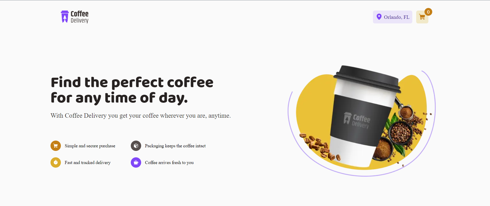

<h1 align="center">Coffee shop</h1>
<p align="center">
  
  
  
</p>
<p align="center">
    
</p>

<br>
<br>

## 🧪 Technologies

This project was developed using the following technologies:

- [NodeJS](https://nodejs.org/)
- [NextJS](https://nextjs.dev/)
- [ReactJS](https://reactjs.org/)
- [JavaScript](https://js.org/)
- [TypeScript](https://typescript.org/)
- [TailwindCSS](https://tailwindcss.com/)
  
  ## 🚀 Getting started
Clone the project and access the folder.

```bash
$ https://github.com/weslleyolli/coffee-shop
$ cd coffee-shop
```

Follow the steps below:

### Web

```bash
# Install the web dependencies
$ npm install

# Start the web project
$ npm run dev